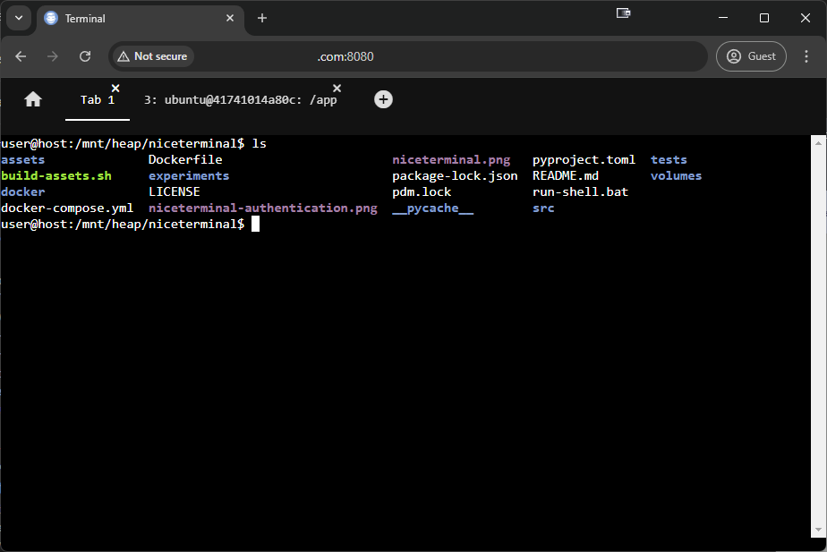

# sioba_nicegui

**sioba_nicegui** is a Python module that integrates XTerm.js with NiceGUI to provide a web-based terminal emulator component.

## Overview

This module allows you to easily embed a fully functional terminal emulator in your NiceGUI applications. It can be used as a standalone terminal or connected to a backend interface (from the `sioba` module) to interact with processes like shells or custom functions.

## Features

*   **XTerm.js Integration:** Utilizes the power and flexibility of XTerm.js, a popular terminal emulator for the web.
*   **Standalone Mode:** Use the terminal as a simple display for text output.
*   **Interface Mode:** Connect the terminal to backend processes using interfaces from the `sioba` module.
*   **Customization:** Configure the terminal's appearance and behavior using `TerminalConfig`.
*   **NiceGUI Compatible:** Seamlessly integrates with the NiceGUI framework.

## Installation

To install `sioba_nicegui`, you can use pip:

```bash
pip install sioba_nicegui
```

## Usage

### Standalone Mode

Here's a basic example of using `XTerm` in standalone mode:

```python
from nicegui import ui
from sioba_nicegui.xterm import XTerm

# Create an XTerm instance
term = XTerm()
term.classes("w-full h-full")

# Write some text to the terminal
term.write(b"Hello, world!\n")

ui.run()
```

### With a Shell Interface

You can connect the `XTerm` component to a shell interface (e.g., `sioba.ShellInterface` from the `sioba` module) to create an interactive web-based shell:

```python
from nicegui import ui
from sioba_nicegui.xterm import XTermInterface
from sioba.shell import ShellInterface  # Assuming ShellInterface is available

# Create a shell interface
shell_interface = ShellInterface()

# Create an XTerm instance and connect it to the interface
term = XTermInterface(interface=shell_interface)
term.classes("w-full h-full")

ui.run()
```
*(Note: The availability and usage of `ShellInterface` might vary. Please refer to the `sioba` module documentation for more details.)*

### Customizing the Terminal

You can customize the terminal's appearance and behavior using the `TerminalConfig` class:

```python
from nicegui import ui
from sioba_nicegui.xterm import XTerm, TerminalConfig

# Define custom terminal configuration
config = TerminalConfig(
    rows=30,
    cols=100,
    font_size=16,
    cursor_blink=True,
    theme={
        "background": "#1e1e1e",
        "foreground": "#d4d4d4",
    }
)

# Create an XTerm instance with the custom configuration
term = XTerm(config=config)
term.classes("w-full h-full")

ui.run()
```

## Screenshots

Here's a screenshot of the `sioba_nicegui` terminal in action:



*(Image path: `sioba_nicegui/sioba-nicegui-webterminal.png`)*

## Contributing

Contributions are welcome! If you find any issues or have suggestions for improvements, please open an issue or submit a pull request on the project's repository.

## License

This module is licensed under the MIT No Attribution License. Please refer to the `LICENSE` file for more details.
